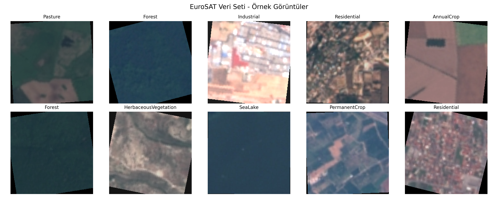
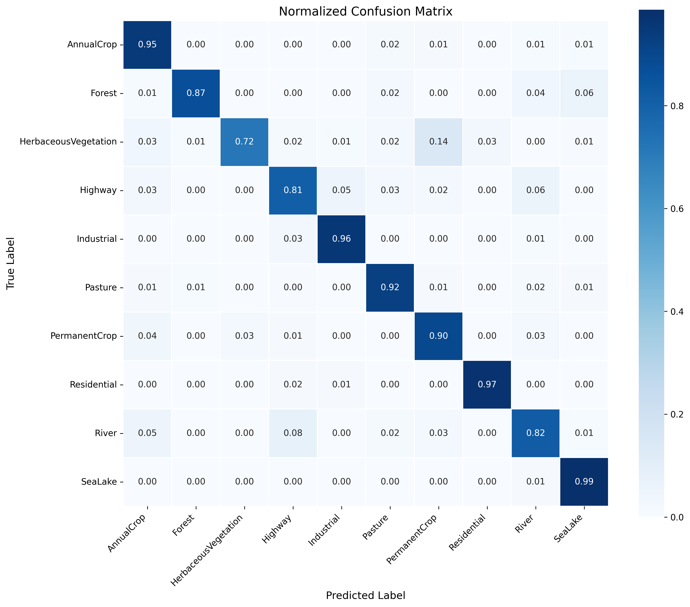
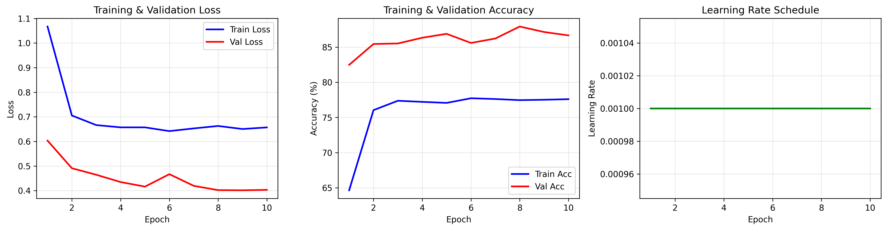
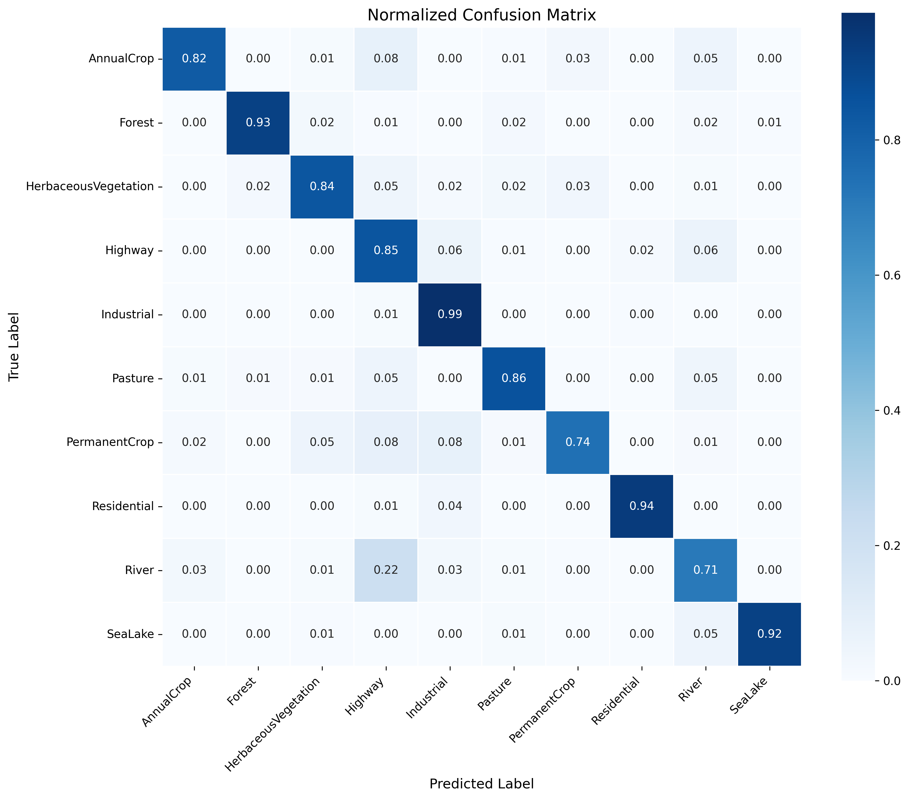
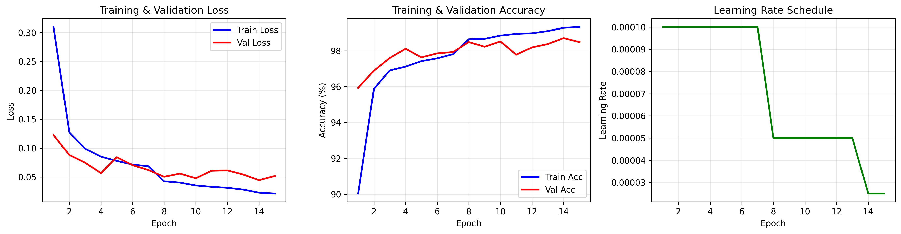
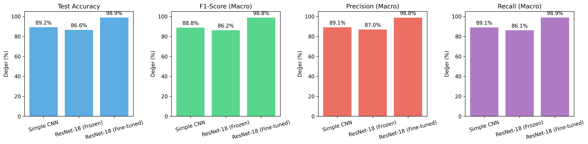

# 🛰️ EuroSAT: Uydu Görüntüleri ile Arazi Sınıflandırma Projesi

**Derin Öğrenme Dersi Projesi**

Bu proje, Sentinel-2 uydusundan elde edilen görüntüler üzerinden arazi kullanımı sınıflandırması yapmayı amaçlamaktadır. Projede sıfırdan tasarlanan bir CNN modeli ile transfer öğrenme yaklaşımları karşılaştırmalı olarak değerlendirilmiştir.

---

## 📑 İçindekiler
1. [Proje Konusu ve Seçim Gerekçesi](#1-proje-konusu-ve-seçim-gerekçesi)
2. [Veri Seti](#2-veri-seti)
3. [Yöntem ve Algoritma Seçimi](#3-yöntem-ve-algoritma-seçimi)
4. [Model Eğitimi ve Değerlendirme](#4-model-eğitimi-ve-değerlendirme)
5. [Sonuçlar ve Karşılaştırma](#5-sonuçlar-ve-karşılaştırma)
6. [Proje Yapısı ve Kurulum](#6-proje-yapısı-ve-kurulum)
7. [Kaynaklar](#7-kaynaklar)

---

## 1. Proje Konusu ve Seçim Gerekçesi

### 1.1 Proje Tanımı
Bu projede, Sentinel-2 uydusundan elde edilen RGB görüntüleri kullanarak yeryüzündeki farklı arazi tiplerini (orman, nehir, yerleşim yeri, tarım alanı vb.) otomatik olarak sınıflandıran bir derin öğrenme modeli geliştirdim.

### 1.2 Neden Bu Projeyi Seçtim?
Bu projeyi seçmemdeki temel motivasyon, uydu görüntülerinin gerçek hayatta ne kadar faydalı olabileceğini görmekti. Düşündüğümde şu kullanım alanları aklıma geldi:

- **Çevresel İzleme:** Yıldan yıla bir şehrin orman yüzdesinin nasıl değiştiğini takip edebiliriz. Örneğin 2015'te %30 olan orman alanı, 2025'te %20'ye düşmüş mü?
- **Sanayileşme Takibi:** Bir bölgedeki endüstriyel alanların genişlemesini yıllar içinde ölçebiliriz.
- **Su Kaynaklarının Durumu:** Göllerin kuruması, nehirlerin daralması gibi iklim değişikliğinin etkilerini somut verilerle gösterebiliriz.
- **Şehirleşme Analizi:** Kentsel yayılmanın tarım arazileri üzerindeki baskısını ölçümleyebiliriz.

Kısacası, bu tür bir sınıflandırma modeli ile uydu görüntülerinden otomatik veri çıkarabilir ve zaman serisi analizleri yapabiliriz. Bu da çevre, tarım ve şehir planlama gibi alanlarda karar vericilere somut veriler sunmamızı sağlar.

### 1.3 İlgili Alanda Yapılan Önceki Çalışmalar

Literatürde EuroSAT veri seti üzerinde birçok çalışma yapılmıştır:

| Çalışma | Yıl | Yöntem | Doğruluk |
|---------|-----|--------|----------|
| Helber et al. (EuroSAT Orijinal) | 2019 | ResNet-50 | %98.57 |
| Naushad et al. | 2021 | DenseNet-121 | %97.12 |
| Li et al. | 2020 | EfficientNet-B0 | %97.89 |
| Neumann et al. | 2019 | VGG-16 + Transfer Learning | %96.24 |

Bu çalışmalar incelendiğinde, transfer öğrenme yaklaşımının bu veri setinde oldukça başarılı sonuçlar verdiği görülmektedir. Ben de projemde hem sıfırdan bir model eğitmeyi hem de transfer öğrenme yöntemlerini deneyerek literatürdeki bulguları doğrulamak istedim.

### 1.4 Alanın Önemi

Uzaktan algılama ve uydu görüntü analizi, günümüzde yapay zeka alanında en hızlı büyüyen disiplinlerden biridir. Bunun birkaç önemli nedeni var:

- **Veri Bolluğu:** Sentinel, Landsat gibi uydular sürekli olarak dünya yüzeyinin görüntülerini üretiyor.
- **Otomasyon İhtiyacı:** Bu kadar büyük veriyi manuel incelemek imkansız, bu yüzden otomatik sınıflandırma sistemlerine ihtiyaç var.
- **Gerçek Dünya Etkisi:** İklim değişikliği, gıda güvenliği, afet yönetimi gibi kritik konularda doğrudan uygulanabilir.

---

## 2. Veri Seti

### 2.1 EuroSAT RGB Veri Seti

Projede **EuroSAT RGB** veri setini kullandım. Bu veri seti, Avrupa Uzay Ajansı'nın Sentinel-2 uydusundan elde edilen görüntüleri içermektedir.

**Veri Seti Kaynağı:** [DFKI - German Research Center for Artificial Intelligence](https://github.com/phelber/EuroSAT)

### 2.2 Veri Seti İstatistikleri

| Özellik | Değer |
|---------|-------|
| **Toplam Görüntü Sayısı** | 27,000 |
| **Sınıf Sayısı** | 10 |
| **Orijinal Görüntü Boyutu** | 64x64 piksel |
| **Kullanılan Boyut** | 224x224 piksel |
| **Format** | RGB (3 kanal) |

### 2.3 Sınıf Dağılımı

| Sınıf | Görüntü Sayısı |
|-------|----------------|
| AnnualCrop (Yıllık Mahsul) | 3,000 |
| Forest (Orman) | 3,000 |
| HerbaceousVegetation (Otsu Bitki Örtüsü) | 3,000 |
| Highway (Otoyol) | 2,500 |
| Industrial (Endüstriyel Alan) | 2,500 |
| Pasture (Mera) | 2,000 |
| PermanentCrop (Kalıcı Mahsul) | 2,500 |
| Residential (Yerleşim Yeri) | 3,000 |
| River (Nehir) | 2,500 |
| SeaLake (Deniz/Göl) | 2,999 |

### 2.4 Veri Seti Bölümleme

Veriyi şu şekilde böldüm:

| Küme | Oran | Görüntü Sayısı |
|------|------|----------------|
| Eğitim (Train) | %80 | 21,599 |
| Doğrulama (Validation) | %10 | 2,699 |
| Test | %10 | 2,701 |

### 2.5 Örnek Görüntüler

<p align="center">
  
</p>

### 2.6 Veri Ön İşleme

Görüntüler üzerinde şu işlemleri uyguladım:

1. **Yeniden Boyutlandırma:** 64x64'ten 224x224'e (ResNet için)
2. **Normalizasyon:** ImageNet ortalaması ve standart sapması ile
   - Mean: [0.485, 0.456, 0.406]
   - Std: [0.229, 0.224, 0.225]
3. **Veri Artırma (Data Augmentation):** Eğitim setinde
   - Rastgele yatay çevirme
   - Rastgele döndürme (±15°)
   - Renk değişimleri

---

## 3. Yöntem ve Algoritma Seçimi

### 3.1 Neden CNN ve Transfer Öğrenme?

Literatürü incelediğimde, görüntü sınıflandırma problemlerinde Evrişimli Sinir Ağları'nın (CNN) en başarılı yöntem olduğunu gördüm. Özellikle uydu görüntülerinde:

- **Uzamsal Örüntüler:** CNN'ler, görüntülerdeki doku, kenar ve şekil gibi uzamsal özellikleri otomatik olarak öğrenebiliyor.
- **Hiyerarşik Öğrenme:** İlk katmanlarda basit özellikler (kenarlar), derin katmanlarda karmaşık özellikler (yapılar) öğreniliyor.
- **Transfer Öğrenme:** ImageNet gibi büyük veri setlerinde eğitilmiş modeller, daha az veriyle yüksek başarı sağlıyor.

### 3.2 Literatürdeki Yöntemlerin Karşılaştırması

| Yöntem | Avantajları | Dezavantajları | EuroSAT için Uygunluk |
|--------|-------------|----------------|----------------------|
| Geleneksel ML (SVM, RF) | Hızlı eğitim | Manuel özellik çıkarımı gerekir | ❌ Düşük |
| Basit CNN | End-to-end öğrenme | Derin özellik öğrenemez | ⚠️ Orta (Baseline) |
| VGG-16/19 | Kanıtlanmış başarı | Çok fazla parametre | ⚠️ Orta |
| **ResNet-18/50** | Skip connections, hızlı | - | ✅ Yüksek |
| DenseNet | Feature reuse | Bellek tüketimi yüksek | ✅ Yüksek |
| Vision Transformer | Global bağlam | Çok fazla veri gerektirir | ⚠️ Orta |

### 3.3 Seçtiğim Yaklaşımlar

Projede üç farklı model eğittim ve karşılaştırdım:

#### Model A: Simple CNN (Baseline)
Sıfırdan tasarladığım 4 katmanlı bir CNN. Amacım, transfer öğrenme kullanmadan ne kadar başarı elde edebileceğimi görmekti.

**Mimari:**
- 4 Konvolüsyon bloğu (32 → 64 → 128 → 256 filtre)
- BatchNorm + ReLU + MaxPool
- Global Average Pooling
- 2 Fully Connected katman
- Dropout (%50) ile regularization

#### Model B: ResNet-18 (Feature Extraction)
ImageNet üzerinde önceden eğitilmiş ResNet-18 modelini aldım ve tüm konvolüsyon katmanlarını dondurdum. Sadece son sınıflandırma katmanını eğittim.

**Neden bu yaklaşım?**
- ImageNet'te öğrenilen genel görsel özellikler (kenarlar, dokular) uydu görüntülerinde de işe yarar.
- Çok az parametre eğitildiği için hızlı ve overfitting riski düşük.

#### Model C: ResNet-18 (Fine-Tuning)
Model B'nin üzerine, tüm katmanları açarak (unfreeze) daha düşük öğrenme oranıyla ince ayar yaptım.

**Neden bu yaklaşım?**
- Genel özellikler korunurken, uydu görüntülerine özgü özellikler de öğreniliyor.
- En yüksek başarıyı bu yöntemle elde etmeyi bekledim.

### 3.4 ResNet-18 Seçim Gerekçesi

ResNet ailesinden ResNet-18'i seçmemin nedenleri:
1. **Residual Bağlantılar:** Vanishing gradient problemini çözüyor.
2. **Yeterli Derinlik:** 18 katman, bu veri seti için yeterli karmaşıklığı sunuyor.
3. **Hesaplama Verimliliği:** ResNet-50'ye göre daha hızlı eğitim.
4. **Kanıtlanmış Başarı:** Literatürde EuroSAT'ta %95+ başarı elde edilmiş.

---

## 4. Model Eğitimi ve Değerlendirme

### 4.1 Eğitim Konfigürasyonu

| Parametre | Değer |
|-----------|-------|
| **Batch Size** | 64 |
| **Optimizer** | Adam |
| **Loss Function** | CrossEntropyLoss |
| **Learning Rate (CNN)** | 0.001 |
| **Learning Rate (Fine-tune)** | 0.0001 |
| **Epochs** | 10-15 |
| **Early Stopping** | Patience = 5 |
| **LR Scheduler** | ReduceLROnPlateau |
| **Cihaz** | CUDA (GPU) |

### 4.2 Değerlendirme Metrikleri

Model performansını değerlendirmek için şu metrikleri kullandım:

| Metrik | Açıklama |
|--------|----------|
| **Accuracy** | Doğru tahminlerin toplam tahminlere oranı |
| **Precision** | Pozitif tahminlerin ne kadarının gerçekten pozitif olduğu |
| **Recall** | Gerçek pozitiflerin ne kadarının yakalandığı |
| **F1-Score** | Precision ve Recall'un harmonik ortalaması |

Çok sınıflı sınıflandırma olduğu için **Macro** ve **Weighted** ortalamalar kullandım.

### 4.3 Eğitim Süreci

#### Simple CNN Eğitimi
- **Toplam Süre:** 25.55 dakika
- **En İyi Epoch:** 13
- **En İyi Val Accuracy:** %88.85

<p align="center">
  
</p>

**Simple CNN - Confusion Matrix:**

<p align="center">
  
</p>

#### ResNet-18 (Frozen) Eğitimi
- **Toplam Süre:** 15.80 dakika
- **En İyi Epoch:** 8
- **En İyi Val Accuracy:** %87.92

<p align="center">
  
</p>

**ResNet-18 (Frozen) - Confusion Matrix:**

<p align="center">
  
</p>

#### ResNet-18 (Fine-Tuned) Eğitimi
- **Toplam Süre:** 27.08 dakika
- **En İyi Epoch:** 14
- **En İyi Val Accuracy:** %98.70

<p align="center">
  
</p>

**ResNet-18 (Fine-Tuned) - Confusion Matrix:**

<p align="center">
  
</p>

---

## 5. Sonuçlar ve Karşılaştırma

### 5.1 Model Karşılaştırma Tablosu

| Model | Test Accuracy | F1 (Macro) | F1 (Weighted) | Precision | Recall |
|-------|---------------|------------|---------------|-----------|--------|
| Simple CNN | %89.23 | 0.8879 | 0.8915 | 0.8914 | 0.8905 |
| ResNet-18 (Frozen) | %86.56 | 0.8617 | 0.8680 | 0.8695 | 0.8612 |
| **ResNet-18 (Fine-Tuned)** | **%98.85** | **0.9880** | **0.9885** | **0.9876** | **0.9885** |

<p align="center">
  
</p>

### 5.2 Sınıf Bazlı Performans (En İyi Model: ResNet-18 Fine-Tuned)

| Sınıf | Precision | Recall | F1-Score | Destek |
|-------|-----------|--------|----------|--------|
| AnnualCrop | 0.98 | 0.98 | 0.98 | 314 |
| Forest | 1.00 | 0.99 | 0.99 | 294 |
| HerbaceousVegetation | 0.99 | 0.98 | 0.99 | 286 |
| Highway | 0.99 | 0.99 | 0.99 | 264 |
| Industrial | 1.00 | 0.99 | 0.99 | 243 |
| Pasture | 0.96 | 0.99 | 0.98 | 213 |
| PermanentCrop | 0.97 | 0.99 | 0.98 | 230 |
| Residential | 1.00 | 1.00 | 1.00 | 325 |
| River | 0.98 | 0.98 | 0.98 | 239 |
| SeaLake | 1.00 | 0.99 | 0.99 | 293 |

### 5.3 Sonuçların Yorumlanması

Elde ettiğim sonuçları şöyle yorumluyorum:

1. **Sıfırdan CNN vs Transfer Öğrenme:** Simple CNN %89 başarı elde ederken, fine-tuned ResNet %98.85 başarı elde etti. Bu, transfer öğrenmenin ne kadar güçlü olduğunu açıkça gösteriyor.

2. **Frozen vs Fine-Tuned:** İlginç bir şekilde, frozen ResNet (%86.56) simple CNN'den (%89.23) daha düşük kaldı. Bu, sadece son katmanı eğitmenin bu veri seti için yeterli olmadığını gösteriyor.

3. **Fine-Tuning'in Gücü:** Tüm katmanları açıp düşük öğrenme oranıyla eğittiğimde %98.85 gibi çok yüksek bir başarıya ulaştım. Bu, literatürdeki sonuçlarla uyumlu.

4. **En Zor Sınıflar:** Confusion matrix'e bakıldığında, bazı sınıfların birbiriyle karışabildiği görülüyor (örneğin River-Highway benzerliği), ancak fine-tuned model bu ayrımı da başarıyla yapabiliyor.

---

## 6. Proje Yapısı ve Kurulum

### 6.1 Dizin Yapısı

```
EuroSAT/
├── README.md                 # Bu dosya
├── requirements.txt          # Gerekli kütüphaneler
├── data/
│   └── 2750/                 # EuroSAT veri seti
│       ├── AnnualCrop/
│       ├── Forest/
│       └── ...
├── models/                   # Eğitilmiş model dosyaları (.pth)
├── notebooks/
│   └── main_project.ipynb    # Ana proje notebook'u
├── reports/
│   └── figures/              # Grafikler ve görseller
└── src/
    ├── __init__.py
    ├── data_loader.py        # Veri yükleme fonksiyonları
    ├── model.py              # Model tanımları (SimpleCNN, ResNet)
    └── train_utils.py        # Eğitim yardımcı fonksiyonları
```

### 6.2 Kurulum

```bash
# Repoyu klonlayın
git clone https://github.com/ishakturk/EuroSAT.git
cd EuroSAT

# Sanal ortam oluşturun
python -m venv venv
venv\Scripts\activate  # Windows

# Gereksinimleri yükleyin
pip install -r requirements.txt
```

### 6.3 Gereksinimler

```
torch>=2.0.0
torchvision>=0.15.0
numpy>=1.24.0
pandas>=2.0.0
matplotlib>=3.7.0
seaborn>=0.12.0
scikit-learn>=1.3.0
Pillow>=10.0.0
tqdm>=4.65.0
jupyter>=1.0.0
```

### 6.4 Kullanım

1. `notebooks/main_project.ipynb` dosyasını Jupyter Notebook veya Google Colab'da açın.
2. Hücreleri sırayla çalıştırın.
3. Eğitilmiş modeller `models/` klasörüne kaydedilecektir.

---

## 7. Kaynaklar

### Akademik Referanslar

1. Helber, P., Bischke, B., Dengel, A., & Borth, D. (2019). "EuroSAT: A Novel Dataset and Deep Learning Benchmark for Land Use and Land Cover Classification." *IEEE Journal of Selected Topics in Applied Earth Observations and Remote Sensing*.

2. He, K., Zhang, X., Ren, S., & Sun, J. (2016). "Deep Residual Learning for Image Recognition." *IEEE Conference on Computer Vision and Pattern Recognition (CVPR)*.

3. Neumann, M., Pinto, A. S., Zhai, X., & Houlsby, N. (2019). "In-domain representation learning for remote sensing." *arXiv preprint*.

### Veri Seti

- **EuroSAT:** [https://github.com/phelber/EuroSAT](https://github.com/phelber/EuroSAT)

---

### Test Kaynağı

- **Sentinel Uydu Haritası:** [https://s2maps.eu/#](https://s2maps.eu/#)

## 📊 Özet

| Kriter | Detay |
|--------|-------|
| **En İyi Model** | ResNet-18 (Fine-Tuned) |
| **Test Accuracy** | %98.85 |
| **F1-Score (Macro)** | 0.9880 |
| **Toplam Eğitim Süresi** | ~68 dakika (3 model) |
| **Kullanılan Framework** | PyTorch |
| **Donanım** | NVIDIA GPU (CUDA) |

---

**Hazırlayan:** İshak Türk  
**Ders:** Derin Öğrenme  
**Tarih:** Aralık 2025

